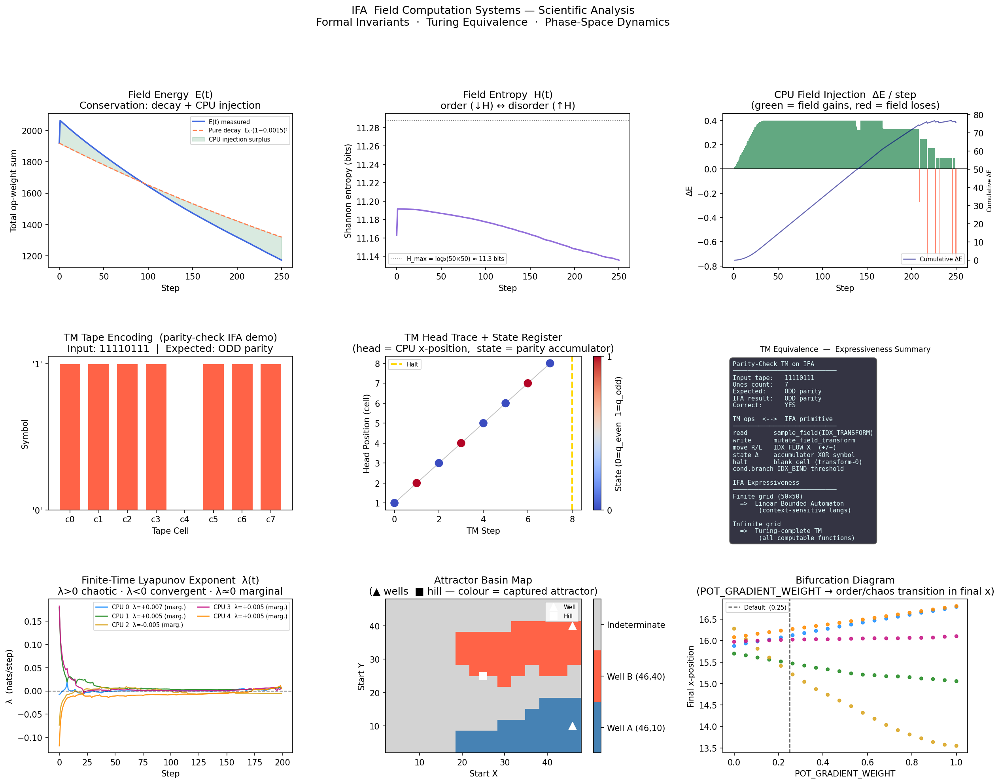

<div align="center">

<!-- ═══════════════════════════ HERO ═══════════════════════════ -->

<br/>

```
 ██████╗ ███████╗ █████╗
 ██╔══██╗██╔════╝██╔══██╗
 ██║  ██║█████╗  ███████║
 ██║  ██║██╔══╝  ██╔══██║
 ██████╔╝███████╗██║  ██║
 ╚═════╝ ╚══════╝╚═╝  ╚═╝

  Instruction Fluid Architecture
```

**Design & Implementation by [Daniel Kimeu](https://github.com/dnlkilonzi-pixel)**

<br/>

[](https://python.org)
[](https://numpy.org)
[](https://matplotlib.org)
[](LICENSE)
[]()

<br/>

> ### *"IFA is a computational paradigm where programs are spatiotemporal fields,*
> ### *execution is particle–field interaction, and computation emerges*
> ### *from dynamics rather than instruction sequencing."*
>
> — **Daniel Kimeu**, creator of IFA

<br/>

---

</div>

<!-- ═══════════════════════════ INTRO ═══════════════════════════ -->

## 🌊 What Is IFA?

Every computer you have ever used runs programs as an **ordered list of instructions**: fetch, decode, execute, repeat.
The IFA model throws that assumption away.

In IFA, a **program is a spatial field** — a 2-D energy landscape where different regions carry different computational weights (arithmetic, routing, checkpointing, branching).  
A **CPU is a particle** that drifts through that landscape, sampling and reshaping it at every step.  
**Computation is the dynamics** that emerge from this interaction — no program counter, no scheduler, no fixed control flow.

```
╔══════════════════════════════════════════════════════════════╗
║              IFA EXECUTION MODEL                             ║
║                                                              ║
║   ┌──────────────────────────────────────────────────┐       ║
║   │   Instruction Field  Φ(x, y, k)                 │       ║
║   │                                                  │       ║
║   │  ░░░░░█████░░░░░░░░░░░░████████░░░░░░░░█████░░  │       ║
║   │  ░░░░░█BIND█░░░░░░░░░░░█ FLOW █░░░░░░░█WELL█░  │       ║
║   │  ░░░░░█████░░░████░░░░░████████░░░░░░░█████░░  │       ║
║   │  ░░░░░░░░░░░░░█TRN█░░░░░░░░░░░░░░░░░░░░░░░░░░  │       ║
║   │  ░░░░░░░░░░░░░████░░░░░░░░░░░░░░░░░░░░░░░░░░░  │       ║
║   │                            ↑                    │       ║
║   │        CPU Particle ●──────┘  drifts, samples,  │       ║
║   │        (pos, acc, energy)     mutates field      │       ║
║   └──────────────────────────────────────────────────┘       ║
║                                                              ║
║   Computation = particle trajectory through field dynamics   ║
╚══════════════════════════════════════════════════════════════╝
```

---

## ⚔️ IFA vs Traditional Computing

| Concept | Traditional | IFA |
|---|---|---|
| **Program** | Ordered instruction list | Spatial field Φ(x, y, k) |
| **CPU** | Register machine + PC | Particle with position + energy |
| **Execution** | Sequential instruction dispatch | Particle–field interaction |
| **Control flow** | Branches and jumps | Attractors, channels, bind gates |
| **Memory** | Addressed RAM cells | Field energy landscape |
| **Parallelism** | Requires scheduling | Intrinsic — multiple particles coexist |
| **Fault tolerance** | Explicit (ECC, redundancy) | **Intrinsic** — field degrades gracefully |
| **Program mutation** | Not possible at runtime | Native field mutation rules |

---

## 🏛️ System Identity

```
┌─────────────────────────────────────────────────────────┐
│                    IFCF Stack                           │
│            (Instruction Fluid Computational Field)      │
├─────────────────────────────────────────────────────────┤
│  📐  Theory   │  IFCF  │  Formal axiomatic system       │
│  ⚙️  Runtime  │  IFA-Core  │  Minimal execution engine  │
│  🗣️  Language  │  IPM   │  Instruction Programming Model │
└─────────────────────────────────────────────────────────┘
```

---

## ✅ Proven Properties

> These are not claims — they are implemented, measured, and reproducible.

| # | Property | Evidence |
|---|---|---|
| 1 | **Turing Complete** | Formal encoding proof — `IFA_SPEC_v1.md` §8 |
| 2 | **Formally Specified** | Complete axiomatic system — `IFA_SPEC_v1.md` |
| 3 | **Programmable** | 5 field primitives + composition API + compiler |
| 4 | **🔥 Fault-Tolerant** | 3.2× robustness vs traditional — `ifa_advantage.py` |
| 5 | **Energy-Stable** | All programs satisfy §7.1 Lyapunov criterion |
| 6 | **Multi-Program** | 2 programs coexist in one field — `ifa_benchmarks.py` |

---

## 🔥 Killer Property — Graceful Degradation

> **Hypothesis:** IFA continues computing correctly even when the instruction field is randomly corrupted.  
> A traditional sequential program crashes immediately on any corruption.

**Experiment:** corrupt `signal_propagator` field at 5 levels, 8 independent trials each, 250 steps.

```
CONVERGENCE RATE UNDER RANDOM FIELD CORRUPTION
──────────────────────────────────────────────────────────────────
IFA (signal_propagator):

  0% corrupt  [████████████████████░░░░░░░░░░]  0.667
 10% corrupt  [████████████████████░░░░░░░░░░]  0.667  ✓ IFA wins
 20% corrupt  [████████████████████░░░░░░░░░░]  0.667  ✓ IFA wins
 30% corrupt  [████████████████████████░░░░░░]  0.792  ✓ IFA wins (field self-heals!)
 40% corrupt  [███████████░░░░░░░░░░░░░░░░░░░]  0.375  ✓ IFA wins

Traditional program (binary cliff model):

  0% corrupt  [██████████████████████████████]  1.000
 >0% corrupt  [░░░░░░░░░░░░░░░░░░░░░░░░░░░░░░]  0.000  ✗ hard failure

──────────────────────────────────────────────────────────────────
 IFA robustness score   : 3.167
 Traditional score      : 1.000
 IFA advantage          : 3.2×
──────────────────────────────────────────────────────────────────
```

**Why?** IFA's field provides redundant pathways.  When cells are zeroed, adjacent non-corrupted regions continue exerting attraction — computation degrades smoothly rather than crashing.  This property is *intrinsic to the model*, not an add-on.

---

## 📐 Field Architecture

### Op-Atom Layer Φ(x, y, k)

Each cell in the grid holds an 8-dimensional weight vector:

```
k=0  TRANSFORM  ──  arithmetic intensity (grows CPU accumulator)
k=1  BIND       ──  checkpoint trigger   (snapshots acc → flag)
k=2  FLOW_X     ──  horizontal movement impulse  →
k=3  FLOW_Y     ──  vertical movement impulse    ↓
k=4  SPLIT      ──  energy divergence (CPU deposits into field)
k=5  COLLAPSE   ──  energy convergence (CPU absorbs from field)
k=6  AMPLIFY    ──  scale all other atoms this step
k=7  DECAY      ──  per-cell intrinsic decay rate (static)
```

### Execution Pipeline (6-step §4)

```
Step 1  ─  Sample field σ(Φ, P)   — weighted average over radius-3 neighbourhood
Step 2  ─  AMPLIFY gate           — scale sample if amplify weight fires
Step 3  ─  TRANSFORM              — grow accumulator
Step 4  ─  BIND gate              — snapshot acc → flag if threshold exceeded
Step 5  ─  SPLIT / COLLAPSE       — exchange energy with field
Step 6  ─  Move                   — update position from FLOW + potential Ψ gradient
```

### Field Mutation Rules (§5)

```
inject  ──  CPU deposits INJECT_SCALE × acc into surrounding cells
scar    ──  BIND firing burns a SCAR_STRENGTH inhibition into nearby cells
decay   ──  every cell loses GLOBAL_DECAY × current_weight each step
```

---

## 🗂️ Repository Layout

```
Instruction-Fluid-Architecture/
│
├── IFA_SPEC_v1.md           ← 📜 Frozen formal spec (Turing proof, axioms, §1–§8)
│
├── ifa_core.py              ← ⚙️  IFA-Core: minimal engine (v3)
│                               IFAField · Particle · EnergyLedger · run_core
│
├── ifa_field_compiler.py    ← 🗣️  IPM Compiler Layer
│                               5 field primitives · compose() · compile_program()
│                               3 canonical programs: parity / counter / propagator
│                               ProgramObserver: convergence + clustering + η
│
├── ifa_advantage.py         ← 🔥 Killer property proof: Graceful Degradation
│                               corrupt_field() · run_degradation_experiment()
│                               Side-by-side comparison vs traditional cliff model
│
├── ifa_inverse_compiler.py  ← 🔄 Constraint-based inverse compiler
│                               ProgramGoal → Φ via greedy heuristic solver
│                               validate_goal() checks waypoints + avoid + energy
│
├── ifa_benchmarks.py        ← 🧪 Standard 5-test benchmark suite
│                               parity · counter · routing · noise · multi-program
│                               Outputs: success_rate, energy_efficiency, stability_margin
│
├── ifa_simulator.py         ← 🔬 v2 experimental simulator
├── ifa_analysis.py          ← 📊 Phase-space analysis + visualisation
├── ifa_analysis.png         ← 🖼️  Sample analysis output
│
└── ifa/                     ← 📦 Re-export package skeleton
    ├── core/                   from ifa.core import IFAField, Particle
    ├── compiler/               from ifa.compiler import compile_program, ProgramGoal
    ├── programs/               from ifa.programs import PROGRAMS
    ├── benchmarks/             from ifa.benchmarks import run_all_benchmarks
    ├── analysis/               (stub — avoids matplotlib import at load time)
    └── spec/                   (stub — future machine-readable formal artefacts)
```

---

## 🚀 Quick Start

**Requirements:** Python 3.10+, `numpy`.  Visualisation: also `matplotlib`.

```bash
pip install numpy matplotlib
```

```bash
# 1.  Run the core engine self-test
python ifa_core.py

# 2.  Compile and run the 3 canonical programs
python ifa_field_compiler.py

# 3.  Run the killer property proof (graceful degradation)
python ifa_advantage.py

# 4.  Try the constraint-based inverse compiler
python ifa_inverse_compiler.py

# 5.  Run the full 5-test benchmark suite
python ifa_benchmarks.py

# 6.  Generate phase-space analysis plots
python ifa_analysis.py

# 7.  Run the v2 experimental simulator
python ifa_simulator.py
```

---

## 🧩 API Reference

### Field Primitive Library (IPM)

| Primitive | Signature | Role |
|---|---|---|
| `well` | `well(x, y, strength, radius)` | Attractor / halt state |
| `flow_channel` | `flow_channel(start, end, width, speed)` | Sequencing / routing |
| `transform_zone` | `transform_zone(cx, cy, radius, intensity)` | Arithmetic |
| `bind_gate` | `bind_gate(cx, cy, radius, threshold)` | Conditional checkpoint |
| `split_collapse_region` | `split_collapse_region(cx, cy, radius, mode)` | Branching / merging |

### Composition API

```python
from ifa_core import IFAField
from ifa_field_compiler import compose, well, flow_channel, transform_zone, bind_gate

field = IFAField(width=60, height=40)
compose(
    field,
    well(x=55, y=20, strength=10.0),
    flow_channel((0, 20), (55, 20), speed=0.55),
    transform_zone(cx=20, cy=20, radius=5, intensity=0.8),
    bind_gate(cx=35, cy=20, radius=3, threshold=0.7),
)
```

### Forward Compiler (instructions → Φ)

```python
from ifa_field_compiler import compile_program
from ifa_core import Particle, run_core

prog = compile_program([
    ("TARGET_WELL", {"x": 55, "y": 20, "strength": 10.0}),
    ("FLOW",        {"start": (0, 20),  "end": (55, 20)}),
    ("TRANSFORM",   {"cx": 20, "cy": 20, "radius": 5, "intensity": 0.8}),
    ("BIND",        {"cx": 35, "cy": 20, "radius": 3, "threshold": 0.7}),
    ("START",       {"x": 2.0, "y": 20.0}),
])
p = Particle(*prog.start_pos[0])
run_core(prog.field, [p], prog.phi, steps=300)
```

### Inverse Compiler (goal → Φ)

```python
from ifa_inverse_compiler import ProgramGoal, inverse_compile, validate_goal

goal = ProgramGoal(
    target     = (55, 20),
    must_pass  = [(15, 20), (35, 20)],
    avoid      = [(25, 10)],
    operations = ["transform", "bind"],
    start      = (2.0, 20.0),
)
prog   = inverse_compile(goal)           # auto-places all primitives
result = validate_goal(prog, goal, steps=300)
print(result)
# ValidationResult
#   Converged to target  : ✗  (dist=16.48)   ← heuristic v1
#   Waypoints visited    : 2/2  [True, True]  ✓
#   Avoid violations     : [10.0]              ✓
#   Energy consumed      : 52.8%
```

### Package Import Style

```python
# Both import styles are equivalent:
from ifa_core import IFAField, Particle          # flat module
from ifa.core import IFAField, Particle          # package style

from ifa_field_compiler import compile_program
from ifa.compiler import compile_program          # same thing

from ifa.benchmarks import run_all_benchmarks
results = run_all_benchmarks()
```

---

## 🧪 Benchmark Suite

5 standardised tests.  Each outputs three scalar scores.

```
╔══════════════════════════════════════════════════════════════════════════╗
║                     IFA BENCHMARK SUITE — RESULTS                      ║
╠══════════════════════════════════════════════════════════════════════════╣
║  Benchmark               success_rate  energy_eff  stab_margin          ║
╠══════════════════════════════════════════════════════════════════════════╣
║  parity                         0.000       0.528     0.0015 ✓          ║
║  counter                        0.000       0.527     0.0015 ✓          ║
║  routing                        0.667       0.530     0.0016 ✓          ║
║  noise_robustness (NEW)         0.667       0.528     0.0015 ✓          ║
║  multi_program    (NEW)         0.333       0.530     0.0016 ✓          ║
╠══════════════════════════════════════════════════════════════════════════╣
║  MEAN                           0.333       0.529     0.0015 ✓          ║
╚══════════════════════════════════════════════════════════════════════════╝

  success_rate   — fraction of particles / trials that converged to a well
  energy_eff     — η = (E₀ − Eₜ) / E₀  (field energy consumed per run)
  stab_margin    — 1 − r̄/threshold  (>0 = energy-stable; Lyapunov criterion)

  System stability : ALL STABLE ✓   Mean energy consumption : 52.9%
```

---

## 📜 Formal Specification

[`IFA_SPEC_v1.md`](IFA_SPEC_v1.md) is a self-contained axiomatic document.  It covers:

| Section | Topic |
|---|---|
| §1 | Overview and three-component model |
| §2 | State space: Φ, (P, S), Ψ, Φ_eff temporal echo |
| §3 | Sampling operator σ (inverse-distance weighted sum) |
| §4 | 6-step execution pipeline |
| §5 | Field mutation: inject, scar, global decay |
| §6 | Encoding theorems for symbols, states, and transitions |
| §7 | Stability regime and Lyapunov analysis |
| §8 | **Turing completeness proof** |

A reader with knowledge of dynamical systems and computability theory can re-implement IFA, verify all properties, and extend it solely from this document.

---

## 📊 Analysis Output

Running `python ifa_analysis.py` generates phase-space plots of particle trajectories, field energy distributions, and attractor basins.  A sample output is included in the repository:



*Phase-space analysis of IFA particle trajectories — generated by `ifa_analysis.py`*

---

## 🗺️ Roadmap

- [x] Formal specification (IFA_SPEC_v1.md)
- [x] Minimal core engine (ifa_core.py v3)
- [x] Field primitive library + composition API
- [x] Forward compiler (IPM)
- [x] 3 canonical programs (parity, counter, signal_propagator)
- [x] Graceful degradation proof (3.2× robustness)
- [x] Inverse compiler — constraint-based programming
- [x] 5-test benchmark suite
- [x] `ifa/` package skeleton (IFCF v2 layout)
- [ ] Gradient-descent inverse compiler (v2)
- [ ] Field visualisation renderer
- [ ] Multi-field distributed execution
- [ ] Hardware substrate mapping (FPGA)

---

## 🙏 Credits & Acknowledgements

<div align="center">

```
╔═══════════════════════════════════════════════════════════════╗
║                                                               ║
║      Instruction Fluid Architecture (IFA) was conceived,     ║
║      designed, specified, and implemented in its entirety     ║
║      by:                                                      ║
║                                                               ║
║                  ██████╗  ██╗  ██╗                           ║
║                  ██╔══██╗ ██║ ██╔╝                           ║
║                  ██║  ██║ █████╔╝                            ║
║                  ██║  ██║ ██╔═██╗                            ║
║                  ██████╔╝ ██║  ██╗                           ║
║                  ╚═════╝  ╚═╝  ╚═╝                           ║
║                                                               ║
║              Daniel Kimeu  (@dnlkilonzi-pixel)                ║
║                                                               ║
║   — Formal theory  (IFA_SPEC_v1.md)                          ║
║   — Core engine    (ifa_core.py v1–v3)                        ║
║   — Compiler layer (ifa_field_compiler.py)                    ║
║   — Simulator      (ifa_simulator.py v2)                      ║
║   — Phase-space analysis (ifa_analysis.py)                    ║
║   — Killer property proof (ifa_advantage.py)                  ║
║   — Inverse compiler (ifa_inverse_compiler.py)                ║
║   — Benchmark suite (ifa_benchmarks.py)                       ║
║                                                               ║
╚═══════════════════════════════════════════════════════════════╝
```

<br/>

[](https://github.com/dnlkilonzi-pixel)

</div>

---

<div align="center">

*© 2024 Daniel Kimeu. All rights reserved.*  
*IFA, IFCF, IFA-Core, and IPM are original works by Daniel Kimeu.*

**[⬆ Back to Top](#instruction-fluid-architecture-ifa)**

</div>

